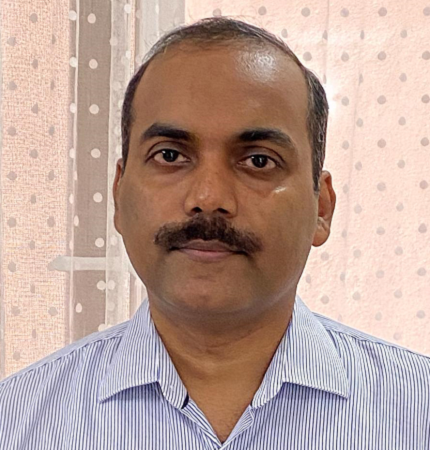

<!-- Banner -->
<section id="banner">
  <header>
    <h2>Welcome to the Climate Dynamics Lab</h2>
    
Exploring monsoon dynamics, climate change, and AI in atmospheric sciences.

  </header>
</section>

<!-- About PI Section -->
<section class="wrapper style1 special">
  

    <header>
      <h2>Meet Our PI</h2>
    </header>
    

      

        
      

      

        <h3>Dr. S. Sandeep</h3>
        <h4>Associate Professor, Centre for Atmospheric Sciences</h4>
        
Dr. Sandeep is an atmospheric scientist specializing in tropical climate dynamics. He earned his PhD from IIT Kharagpur and held postdoctoral positions at IISc Bangalore, University of Oslo, and NYU Abu Dhabi.

        <h4>Research Areas:</h4>
        <ul>
          <li>Indian summer monsoon dynamics</li>
          <li>Climate change and monsoon variability</li>
          <li>AI/ML applications in weather and climate</li>
        </ul>
        <a href="people.html#pi" class="button">Full Profile</a>
      

    

  

</section>

<!-- Carousel -->
<section class="carousel" aria-label="Research Highlights">
  

    <!-- Example Slide -->
    <article>
      
      <header>
        <h3><a href="research.html#monsoon-systems">Genesis of Monsoon Low-Pressure Systems</a></h3>
      </header>
      
Investigating the formation and evolution of monsoon depressions that drive rainfall variability.

    </article>
    <!-- Add more slides as needed -->
  

</section>

<!-- Mission Section -->
<section class="wrapper style2">
  <article class="container special">
    
    <header>
      <h2>Our Mission</h2>
      
Advancing understanding of tropical climate dynamics through cutting-edge research.

    </header>
    

      The Climate Dynamics Lab at IIT Delhi is dedicated to unraveling the complex mechanisms governing the Indian monsoon system and its response to climate change. We employ a multidisciplinary approach combining high-resolution climate modeling, observational data analysis, and machine learning techniques to address fundamental questions about monsoon variability, extreme weather events, and long-term climate trends. Our research aims to improve predictive understanding of the monsoon system and contribute to climate resilience in the region.
    

    <footer>
      <a href="research.html" class="button">Explore Our Research</a>
    </footer>
  </article>
</section>

<!-- Research Themes -->
<section class="wrapper style1">
  

    <header>
      <h2>Research Themes</h2>
      
Key areas of investigation in our laboratory

    </header>
    

      <article class="col-4 col-12-mobile special">
        
        <header>
          <h3><a href="research.html#monsoon-dynamics">Monsoon Dynamics</a></h3>
        </header>
        
Investigating the physical processes governing the Indian summer monsoon, including intraseasonal variability, monsoon breaks, and the role of large-scale circulation patterns.

      </article>
      <!-- Repeat for more research themes -->
    

  

</section>
